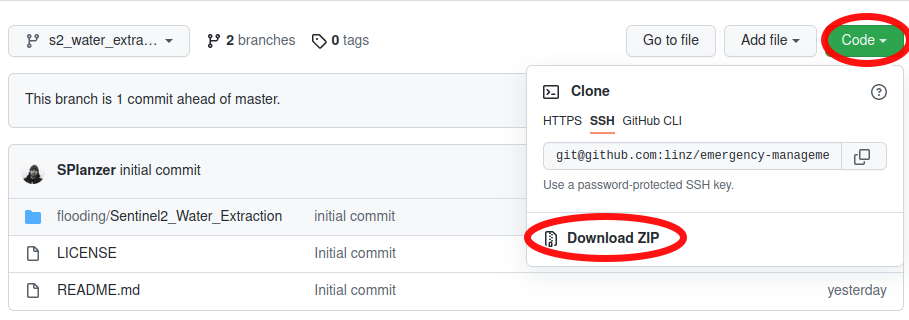

# Sentinel2_Water_Extraction
The Sentinel2_Water_Extraction Jupyter Notebook was developed to extract water from Sentinel-2 imagery. 

Below are the instructions to get the Notebook up and running 
## Install Jupyter
If not already install, You will need to install Jupyter. This can be installed via pip.

`pip install jupyter`

## Get the Jupyter Notebook
Either clone or download the Jupyter Notebook

### Clone the Notebook
Clone this repository to your computer 

`git clone git@github.com:linz/emergency-management.git`

### Download the Notebook
Alternatively, for those not familiar with git, download the repository. This can be downloaded via the code menu in the root of this repository (see below)




## Install Python dependencies
Create and activate a [virtual environment](https://docs.python.org/3/library/venv.html) (optional but recommended).


Install the virtual environment
```
pip install virtualenv
```

Start create and start virtual environment

```
python3 -m venv .venv
source .venv/bin/activate
```

Install the required dependencies

```
pip install -r requirements.txt

```

## Start the Jupyter Notebook
Once you have the code locally, it can be executed to extract water

Open the terminal and navigate to the notebook directory

`cd <path where downloaded to>/emergency-management/flooding/Sentinel2_Water_Extraction`

Start the notebook

`$ jupyter notebook`

Open the Jupyter Notebook by clicking on Sentinel2_Water_Extraction.ipynb (see image below)


## Extract Water From Sentinel-2 imagery
Follow the steps in the Notebook to extract water polygons.

## Troubleshooting 
### SSL cert errors
If encountering an SSL cert error, try exporting a reference to `ca-certificates.crt`

e.g
`export CURL_CA_BUNDLE=/etc/ssl/certs/ca-certificates.crt`
